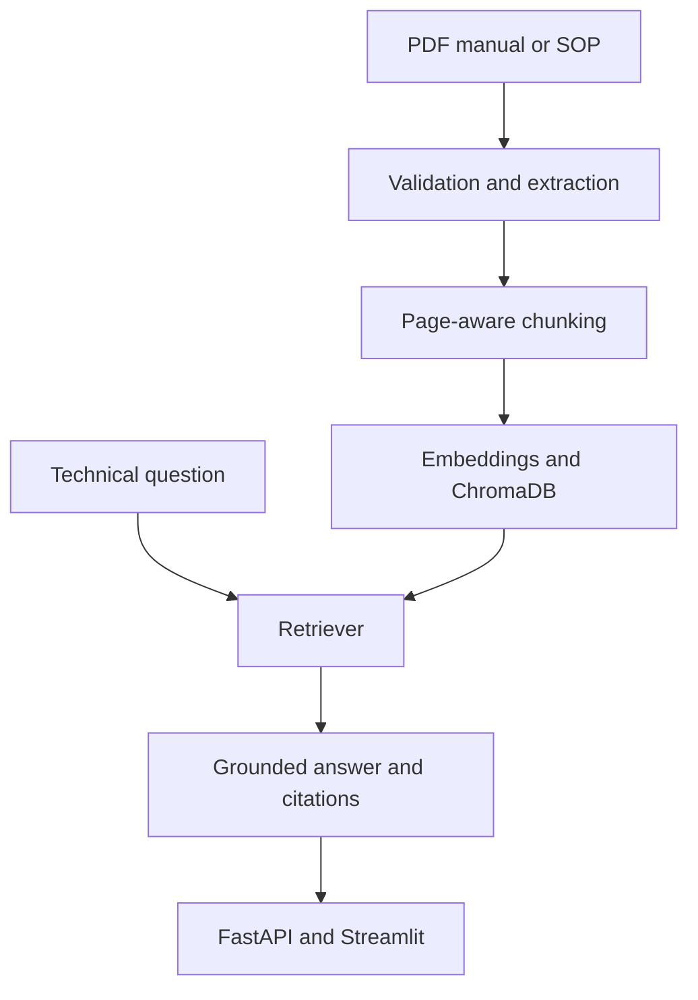

# Planned Architecture

## Main pipeline

## Agent workflow

The maintenance-checklist feature will be a controlled agent rather than a free-running chatbot. It will:

1. interpret the requested maintenance task;
2. retrieve relevant procedures, warnings, tools, and prerequisites;
3. identify missing evidence;
4. create a structured checklist with citations;
5. mark unsupported items or refuse when evidence is insufficient;
6. require human review before use.

## Module responsibilities

| Module | Responsibility |
| --- | --- |
| `document_loader.py` | Extract page text and metadata; detect scanned pages |
| `text_chunker.py` | Produce page-aware, overlapping chunks |
| `embedding_manager.py` | Load the selected embedding model |
| `vector_store.py` | Create and persist document embeddings |
| `retriever.py` | Retrieve, filter, and score evidence |
| `rag_pipeline.py` | Build grounded prompts and generate answers |
| `citation_manager.py` | Preserve and format document/page citations |
| `guardrails.py` | Validate inputs and reduce prompt-injection risk |
| `checklist_agent.py` | Run the cited checklist workflow |

## Design principles

- Retrieval evidence is visible, not hidden.
- Page metadata is preserved from ingestion through final citations.
- The model must be allowed to abstain.
- The agent proposes documents; it does not perform physical actions.
- LLM and embedding providers remain configurable.
- Evaluation begins before interface polish.
- Generated indexes and logs are reproducible or disposable runtime data.

