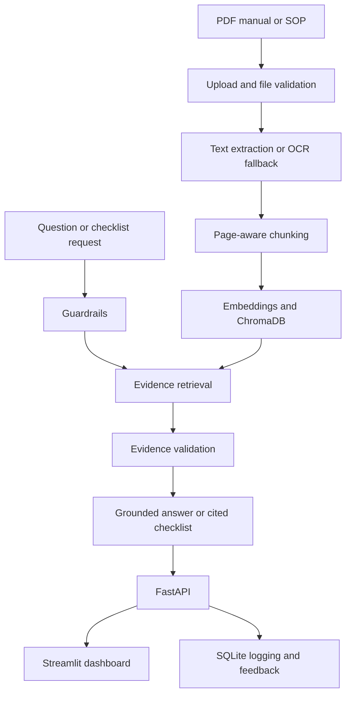
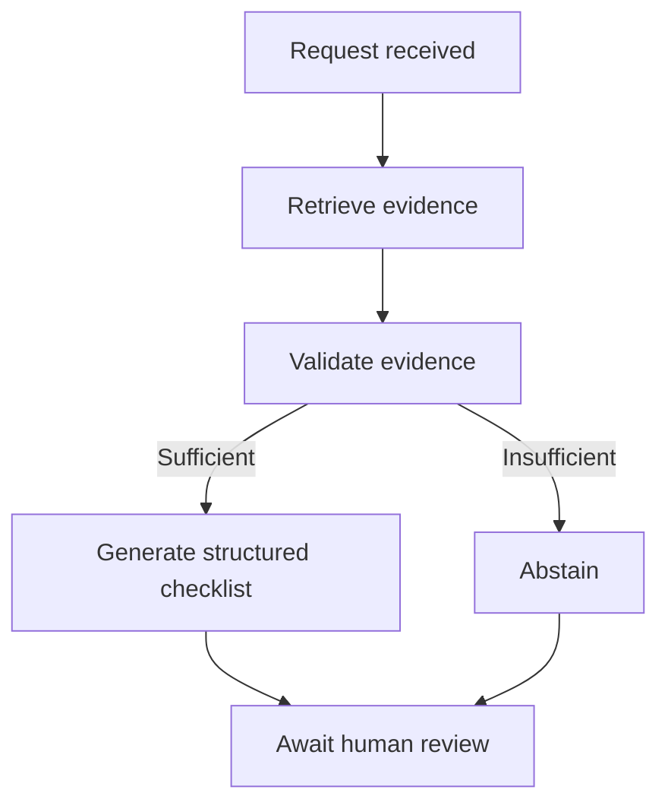

# System Architecture

## Overview

The Engineering Document RAG Agent processes engineering manuals and SOPs into page-aware evidence that can support grounded question answering and structured maintenance-checklist generation.

The system combines PDF ingestion, OCR fallback, vector retrieval, an Ollama language model, safety guardrails, SQLite interaction logging, a FastAPI backend, and a Streamlit dashboard.

## Main pipeline


```mermaid
flowchart TD
    A[PDF manual or SOP] --> B[Upload and file validation]
    B --> C[Text extraction or OCR fallback]
    C --> D[Page-aware chunking]
    D --> E[Embeddings and ChromaDB]
    Q[Question or checklist request] --> F[Guardrails]
    F --> G[Evidence retrieval]
    E --> G
    G --> H[Evidence validation]
    H --> I[Grounded answer or cited checklist]
    I --> J[FastAPI]
    J --> K[Streamlit dashboard]
    J --> L[SQLite logging and feedback]
```

## Document processing

Uploaded files are restricted to safe PDF filenames and a maximum size of 25 MB.

Text is extracted page by page. Pages without usable embedded text can use EasyOCR as a fallback. The extracted content is divided into overlapping chunks while preserving document IDs, source names, page numbers, and page labels.

The default processing configuration is:

| Setting | Value |
| --- | --- |
| Embedding model | `sentence-transformers/all-MiniLM-L6-v2` |
| Chunk size | `1000` characters |
| Chunk overlap | `150` characters |
| Vector collection | `engineering_documents` |
| Vector store | `data/vector_store` |

## Grounded question answering

A technical question passes through input and prompt guardrails before evidence retrieval.

The retriever returns relevant document chunks with similarity scores and page metadata. The RAG pipeline sends the evidence to the configured Ollama model and requires the answer to remain supported by the retrieved documents.

The default runtime configuration is:

| Setting | Value |
| --- | --- |
| LLM model | `qwen3:8b` |
| LLM temperature | `0.0` |
| Default retrieval count | `3` |
| Default Ollama URL | `http://localhost:11434` |

If the available evidence does not satisfy the grounding requirements, the system abstains instead of inventing an answer.

## Controlled checklist workflow

Maintenance-checklist generation follows a controlled sequence:


```mermaid
flowchart TD
    A[Request received] --> B[Retrieve evidence]
    B --> C[Validate evidence]
    C -->|Sufficient| D[Generate structured checklist]
    C -->|Insufficient| E[Abstain]
    D --> F[Await human review]
    E --> F
```

The workflow retrieves and validates procedures, warnings, tools, parts, and prerequisites. Generated checklist items retain page-level citations.

The system proposes a checklist for human review. It does not authorize or perform physical maintenance work.

## Guardrails and safety boundaries

The application includes:

- filename and path validation to prevent unsafe file access;
- PDF type and upload-size validation;
- prompt-injection pattern detection;
- evidence and citation validation;
- mandatory abstention when evidence is insufficient;
- controlled checklist workflow transitions;
- human review before checklist use.

These controls reduce risk but do not replace engineering judgment, approved procedures, or workplace safety requirements.

## Interaction logging

Question-answer interactions are stored in SQLite together with their status, latency, and ordered citation references.

Users can submit positive or negative feedback, and recent interaction history can be retrieved through the API.

The default local database path is:

```text
database/engineering_document_ai.db
```

The `DATABASE_PATH` environment variable can override this location.

## API capabilities

| Method | Route | Purpose |
| --- | --- | --- |
| `GET` | `/health` | Check API health |
| `GET` | `/documents` | List managed documents |
| `GET` | `/documents/{filename}` | Inspect one document |
| `DELETE` | `/documents/{filename}` | Delete a document and its indexed data |
| `POST` | `/documents/upload` | Upload and validate a PDF |
| `POST` | `/documents/{filename}/index` | Process and index a document |
| `POST` | `/questions/ask` | Generate a grounded answer |
| `POST` | `/checklists/generate` | Run the checklist workflow |
| `POST` | `/interactions/{interaction_id}/feedback` | Store user feedback |
| `GET` | `/interactions` | Retrieve recent interaction history |

## Module responsibilities

| Module | Responsibility |
| --- | --- |
| `api/main.py` | Expose document, question, checklist, feedback, and history endpoints |
| `dashboard/app.py` | Provide the Streamlit user interface |
| `src/document_loader.py` | Extract page text and detect pages requiring OCR |
| `src/text_chunker.py` | Create page-aware overlapping chunks and document IDs |
| `src/embedding_manager.py` | Load and manage the embedding model |
| `src/vector_store.py` | Store and persist document embeddings in ChromaDB |
| `src/retriever.py` | Retrieve and filter scored evidence |
| `src/rag_pipeline.py` | Generate and validate grounded answers |
| `src/citation_manager.py` | Create document and page-level citations |
| `src/llm_provider.py` | Communicate with the Ollama language model |
| `src/guardrails.py` | Validate grounded output requirements |
| `src/prompt_guardrails.py` | Detect unsafe or manipulative prompt patterns |
| `src/file_safety.py` | Resolve and validate safe document paths |
| `src/checklist_agent.py` | Control cited maintenance-checklist generation |
| `database/db.py` | Store interactions, citations, feedback, and history |
| `database/schema.sql` | Define the SQLite database schema |

## Docker deployment

Docker Compose runs two services from the same project image:

| Service | Port | Responsibility |
| --- | --- | --- |
| `api` | `8000` | Run the FastAPI backend |
| `dashboard` | `8501` | Run the Streamlit interface |

The dashboard connects to the API through `http://api:8000`. The API connects to Ollama running on the host through `host.docker.internal:11434`.

The local `./data` directory is mounted at `/app/data` inside the API container so uploaded manuals, the vector store, and the Docker SQLite database persist across container restarts.

## Design principles

- Retrieval evidence and citations remain visible.
- Page metadata is preserved throughout the pipeline.
- Unsupported answers and checklists must abstain.
- Generated maintenance content requires human review.
- Runtime data remains reproducible or disposable.
- The API and dashboard remain independently runnable.
- Evaluation results guide retrieval and model decisions.
